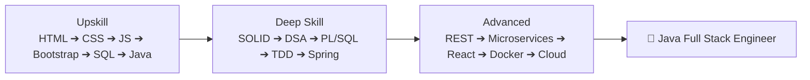

  <h1>🚀 JAVA-FSE</h1>
  
<strong>Java Full Stack Engineer (React)</strong> — Training journey by <a href="https://github.com/Arthi-2005">Arthi-2005</a>

  

    
    
    
    
    
    
    
    
    
    
  

---

## 📂 Repository Structure

| Folder | Description |
|--------|-------------|
| 🟢 [`upskill/`](./upskill) | **Upskill** — Frontend (HTML/CSS/JS/Bootstrap), SQL & Java fundamentals |
| 🔵 [`deepskill/`](./deepskill) | **Deep Skill** — SOLID, Design Patterns, DSA, PL/SQL, TDD, JUnit, Mockito, Lombok |

---

## 🛠️ Tech Stack

<table>
  <tr>
    <th>Category</th>
    <th>Technologies</th>
  </tr>
  <tr>
    <td>🎯 <strong>Backend</strong></td>
    <td>
      
      
      
      
      
      
      
    </td>
  </tr>
  <tr>
    <td>🎨 <strong>Frontend</strong></td>
    <td>
      
      
      
      
      
    </td>
  </tr>
  <tr>
    <td>🗄️ <strong>Database</strong></td>
    <td>
      
      
    </td>
  </tr>
  <tr>
    <td>⚙️ <strong>DevOps & Tools</strong></td>
    <td>
      
      
      
      
      
      
      
      
      
    </td>
  </tr>
</table>

---

## 📊 Learning Path

---

  

    
    
  

  

    
    
  

